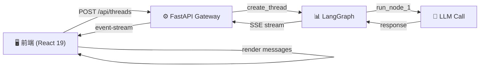

# Day 2: 架构与技术栈深度学习

**日期**: Day 2 (第二天)  
**目标**: 理解 DeerFlow 整体架构，掌握三层通信模式  
**预计时间**: 3-4 小时  
**难度**: ⭐ (简单)  
**前置**: 完成 Day 1  

---

## 📋 学习概念

### 1. LangGraph 核心概念

**什么是 LangGraph?**
- 构建有状态多步代理（stateful multi-step agents）
- 基于图表示的工作流（nodes + edges）
- 支持循环、条件分支、暂停与恢复
- 由 LangChain 官方维护

**核心概念**:
- **State**: 线程状态容器，包含 messages、metadata
- **Node**: 图中的计算单元（LLM 调用、工具执行等）
- **Edge**: 节点间的转移条件（可条件化）
- **Thread**: 独立的执行会话（状态隔离）

### 2. FastAPI 与网关架构

**FastAPI 优势**:
- 基于 Python Type Hints 的自动 API 文档
- 原生异步支持（async/await）
- 依赖注入系统
- 自动 JSON 序列化/反序列化

**网关模式**:
- 前端 → 单一入口（FastAPI Gateway）
- Gateway 作为 Router，转发到 LangGraph、认证、日志等
- 支持多渠道适配（Slack、Telegram、WeChat）

### 3. Next.js 16 与 React 19 应用架构

**Next.js 16 特性**:
- App Router（基于目录的路由）
- Server Components（减少 JavaScript 体积）
- 内置 API Routes（无需单独框架）
- TypeScript 一流支持

**React 19 特性**:
- 内置表单处理（`useFormStatus`、`useActionState`）
- Server Actions（直接在前端调用服务器函数）
- 并发特性

### 4. 前后端通信协议

**标准流程**:
1. 前端发起 REST API 请求 → Gateway
2. Gateway 创建 LangGraph Thread
3. LangGraph 执行代理逻辑
4. Gateway 通过 Server-Sent Events (SSE) 流式返回结果
5. 前端接收事件流，实时更新 UI

**SSE 工作原理**:
```
GET /api/langgraph/threads/{thread_id}/events
→ 连接保持打开
← 后端持续推送事件
  event: message
  data: {"role": "assistant", "content": "..."}
  
  event: function_call
  data: {"tool": "search", ...}
```

### 5. 多渠道架构

**Channel Adapter Pattern**:
```
[Slack]  [Telegram]  [WeChat]  [Web]
   ↓         ↓          ↓        ↓
   └─────[Gateway]─────┘
         ↓         ↓
      [LangGraph]  [Tools]
```

---

## 🎯 学习路线

### Phase 1: 理论理解（60 分钟）

#### 1.1 LangGraph 官方快速入门

```powershell
# 打开浏览器访问官方文档
# https://langchain-ai.github.io/langgraph/

# 或者本地查看示例代码
cd F:\qbot\deer-flow-main\deer-flow-main\backend
# 查看 deerflow 中是否有示例
Get-ChildItem -Recurse -Filter "*.py" -Path "packages/harness/deerflow" | Select-String "graph\|node\|edge" -List | Head -20
```

**学习重点**:
- State 定义与类型系统
- Node 函数与自动转移
- Conditional Edges
- Thread 执行与暂停

#### 1.2 DeerFlow Lead Agent 设计

打开文档了解 DeerFlow 独特的设计:

```powershell
# 查看后端架构文档
notepad F:\qbot\deer-flow-main\deer-flow-main\backend\docs\ARCHITECTURE.md

# 关键部分：
# - "Lead Agent 概念说明"
# - "中间件链（Middleware Chain）"
# - "执行流程"
```

**核心设计**:
- **Lead Agent**: 主代理，协调所有中间件和子代理
- **Middleware Chain**: 前处理、后处理管道（日志、错误处理等）
- **Tool System**: 统一的工具调用接口
- **Memory**: 长期记忆系统（可选）

---

### Phase 2: 源代码分析（90 分钟）

#### 2.1 查看 Gateway 入口

```powershell
cd F:\qbot\deer-flow-main\deer-flow-main\backend

# 打开网关主文件
code app/gateway/__init__.py
# 或
notepad app/gateway/__init__.py
```

**预期看到的内容**:
- FastAPI app 初始化
- CORS 配置
- Route includes（/api/langgraph, /api/models 等）

#### 2.2 查看 LangGraph Thread 路由

```powershell
# 查看处理线程创建、事件流的路由
notepad app/gateway/routes/langgraph_routes.py
# 或
code app/gateway/routes/langgraph_routes.py
```

**关键函数**:
```python
# 创建线程
@router.post("/threads")
async def create_thread(req: CreateThreadRequest) -> ThreadResponse

# 提交输入到线程（触发图执行）
@router.post("/threads/{thread_id}/events")
async def stream_thread_events(thread_id: str, input: InputRequest):
    # 返回 StreamingResponse，使用 SSE 格式

# 获取线程历史
@router.get("/threads/{thread_id}/state")
async def get_thread_state(thread_id: str)
```

**理解 SSE 实现**:
```python
# 伪代码流程
async def stream_thread_events(...):
    async def event_generator():
        for event in langgraph_client.events_stream(...):
            yield f"event: {event.type}\n"
            yield f"data: {json.dumps(event.data)}\n\n"
    
    return StreamingResponse(event_generator(), media_type="text/event-stream")
```

#### 2.3 查看 Lead Agent 定义

```powershell
# 打开核心代理文件
code packages/harness/deerflow/agents/lead_agent.py
# 或
notepad packages/harness/deerflow/agents/lead_agent.py
```

**预期结构**:
```
lead_agent.py
├── ThreadState (Pydantic model)
│   ├── messages: list[MessageType]
│   ├── artifacts: dict
│   └── metadata
├── create_node_* functions
│   ├── create_node_process_input()
│   ├── create_node_llm_call()
│   └── create_node_tool_execution()
├── condition_* functions
│   └── condition_should_call_tool()
└── make_lead_agent() 
    ├── StateGraph(ThreadState)
    ├── add_node("process_input", ...)
    ├── add_edge("process_input", "llm_call")
    ├── add_conditional_edge(...)
    └── compile()
```

#### 2.4 查看中间件链

```powershell
# 查看中间件定义
code packages/harness/deerflow/agents/middleware_chain.py
# 或
notepad packages/harness/deerflow/agents/middleware_chain.py
```

**常见中间件**:
1. **LoggingMiddleware**: 记录所有状态转移
2. **ErrorHandlingMiddleware**: 捕获并处理异常
3. **ArtifactProcessingMiddleware**: 处理生成的工件
4. **MemoryMiddleware**: 更新长期记忆

---

### Phase 3: 前端架构理解（60 分钟）

#### 3.1 查看 Next.js 应用结构

```powershell
cd F:\qbot\deer-flow-main\deer-flow-main\frontend

# 查看路由结构
Get-ChildItem -Recurse src/app | Select-Object Name, FullName
```

**App Router 特点**:
- 每个 `page.tsx` 对应一个路由
- `layout.tsx` 定义布局（多层嵌套）
- `route.ts` 定义 API 端点

#### 3.2 查看 API 集成层

```powershell
# 查看 API 调用封装
notepad src/core/api/client.ts
# 或
code src/core/api/client.ts
```

**关键函数**:
```typescript
// 创建线程
export async function createThread(config: ThreadConfig): Promise<ThreadResponse>

// 流式事件
export async function* streamThreadEvents(threadId: string, input: string): AsyncIterable<Event>

// 获取模型列表
export async function fetchModels(): Promise<ModelList>

// 获取技能列表
export async function fetchSkills(): Promise<SkillList>
```

#### 3.3 查看状态管理

```powershell
# 查看 Zustand/Context 状态管理
notepad src/core/store/*.ts
# 或
code src/core/store/useThreadStore.ts
```

**通常包含**:
- `useThreadStore`: 线程状态、消息历史
- `useModelStore`: 当前选中的模型
- `useUIStore`: UI 状态（侧边栏折叠等）

#### 3.4 查看 SSE 接收端实现

```powershell
# 查看事件流处理
notepad src/core/api/eventHandlers.ts
```

**伪代码逻辑**:
```typescript
export async function* readServerSentEvents(response: Response): AsyncIterable<Event> {
    const reader = response.body?.getReader();
    let buffer = '';
    
    while (true) {
        const { done, value } = await reader.read();
        if (done) break;
        
        buffer += new TextDecoder().decode(value);
        const lines = buffer.split('\n');
        
        for (const line of lines) {
            if (line.startsWith('event:')) {
                // 解析事件类型
            } else if (line.startsWith('data:')) {
                // 解析事件数据
                yield parseEvent(line);
            }
        }
    }
}
```

---

### Phase 4: 完整流程演练（45 分钟）

#### 4.1 绘制架构图

在纸上或使用 Mermaid 绘图工具，画出以下流程:



**保存此图**，用于 Day 3 架构复习。

#### 4.2 追踪一个完整请求周期

假设用户提问："Hello, DeerFlow!"

**时间轴**:

```
T=0ms: 前端发送 POST /api/threads/abc123/events
       Body: { "input": "Hello, DeerFlow!" }
       Headers: Accept: text/event-stream

T=10ms: Gateway 收到请求
        调用 LangGraph Client 的 stream() 方法
        
T=50ms: LangGraph 在 cloud 执行第一个 node
        output: messages = [AIMessage("Loading...")]
        
T=60ms: Gateway SSE 发送第一个事件
        event: message
        data: {"role": "assistant", "content": "Loading..."}

T=100ms: LangGraph 执行 LLM node
         调用 OpenAI API
         
T=2000ms: LLM 返回完整响应
          LangGraph 更新 state
          
T=2010ms: Gateway SSE 发送最终事件
          event: message_done
          data: {...}
          
T=2050ms: 前端收到完整事件
          更新 UI，显示助手回复
          关闭 SSE 连接
```

#### 4.3 查看实际日志

```powershell
# 启动完整应用（如果已配置好）
cd F:\qbot\deer-flow-main\deer-flow-main
make dev

# 在另一个终端，查看日志
Get-Content logs/gateway.log -Tail 50 -Wait

# 发送测试请求（需要另外的终端）
$headers = @{ "Content-Type" = "application/json"; "Accept" = "text/event-stream" }
$body = '{"input":"Hello"}'
Invoke-WebRequest -Uri http://localhost:8001/api/langgraph/threads/test/events `
    -Method POST `
    -Headers $headers `
    -Body $body
```

---

## 📚 关键文档阅读

按以下顺序阅读，加深理解:

1. **架构总览** (15 分钟)
   ```
   backend/docs/ARCHITECTURE.md
   ```

2. **API 规范** (20 分钟)
   ```
   backend/docs/API.md
   ```
   - 认真研究 `/api/langgraph/threads` 端点
   - 理解请求/响应格式
   - 理解 SSE 事件类型

3. **前端集成** (15 分钟)
   ```
   frontend/README.md (架构章节)
   ```

4. **LangGraph 参考** (可选，更深入)(30 分钟)
   ```
   https://langchain-ai.github.io/langgraph/concepts/
   ```

---

## 🔬 实验 1: 解析真实代码

打开并理解以下真实代码片段:

### Experiment 1.1: ThreadState 定义

找到文件:
```powershell
code F:\qbot\deer-flow-main\deer-flow-main\backend\packages\harness\deerflow\agents\agent_state.py
```

**任务**: 
- 理解每个 field 的用途
- 为什么需要 `metadata` 字段？
- `artifacts` 如何工作？

### Experiment 1.2: SSE 路由实现

找到文件:
```powershell
code F:\qbot\deer-flow-main\deer-flow-main\backend\app\gateway\routes\langgraph_routes.py
```

搜索 `@router.post("/threads/{thread_id}/events")`

**任务**:
- 理解异步事件生成器
- 为什么使用 `StreamingResponse`？
- 如何处理客户端断开连接？

### Experiment 1.3: 前端 SSE 接收

找到文件:
```powershell
code F:\qbot\deer-flow-main\deer-flow-main\frontend\src\core\api\eventHandlers.ts
```

**任务**:
- 追踪 SSE 消息的完整解析过程
- TypeScript 如何处理事件类型？
- 如何处理 JSON 解析错误？

---

## ✅ Day 2 验证清单

- [ ] 能解释什么是 LangGraph State
- [ ] 能区分 Node 和 Edge 的作用
- [ ] 理解 Lead Agent 与中间件的关系
- [ ] 能解释 FastAPI Gateway 的作用
- [ ] 理解 SSE 的基本工作原理
- [ ] 能指出前后端通信的 5 个关键步骤
- [ ] 已阅读 ARCHITECTURE.md 与 API.md
- [ ] 在纸上草稿了一个架构图

---

## 📖 学习资源总结

| 资源 | 链接 | 时间 |
|------|------|------|
| LangGraph 官方文档 | https://langchain-ai.github.io/langgraph/ | 20 min |
| DeerFlow 架构文档 | `backend/docs/ARCHITECTURE.md` | 15 min |
| FastAPI 教程 | https://fastapi.tiangolo.com/tutorial/ (快速浏览) | 10 min |
| Next.js 文档 | https://nextjs.org/docs/app (仅路由章节) | 10 min |
| SSE 基础 | MDN Web Docs: Server-Sent Events | 10 min |

---

## 🗂️ 代码组织查看

为了加深印象，运行以下命令获取代码统计:

```powershell
# 后端代码行数统计
cd F:\qbot\deer-flow-main\deer-flow-main\backend
Get-ChildItem -Recurse -Filter "*.py" -Path "packages/harness/deerflow/agents/" | 
    Measure-Object -Property FullName | Select-Object Count
# 预期: 几千行代码

# 前端代码行数统计  
cd F:\qbot\deer-flow-main\deer-flow-main\frontend
Get-ChildItem -Recurse -Filter "*.ts" -Filter "*.tsx" -Path "src/" | 
    Measure-Object -Property FullName | Select-Object Count
# 预期: 数千行代码
```

---

## 🎓 关键术语表

保存以下术语，Day 3+ 会频繁使用:

| 术语 | 定义 | 例子 |
|------|------|------|
| **State** | 线程的数据容器 | `ThreadState(messages=[...], artifacts={})` |
| **Node** | 图执行的单个步骤 | `@node def process_input(state)` |
| **Edge** | 节点间的转移 | `add_edge("node_a", "node_b")` |
| **Thread** | 独立执行会话 | `client.create_thread()` → `thread_123` |
| **SSE** | 服务器推送事件 | `event: message\ndata: {...}\n\n` |
| **Middleware** | 前/后处理中间件 | 日志、错误处理、内存更新 |
| **Sandbox** | 代码隔离执行环境 | 运行用户代码或插件代码 |

---

## 📝 个人笔记建议

在学习此 Day 2 时，推荐记录以下问题的答案:

1. 为什么 DeerFlow 选择 LangGraph 而不是其他框架?
2. 多渠道架构如何避免代码重复?
3. SSE 相比 WebSocket 的优劣?
4. 如何监控或调试 LangGraph 执行?
5. 如果 LLM 调用失败，状态会如何?

---

## ⏱️ 时间记录

| 任务 | 预计时间 | 实际时间 |
|------|---------|---------|
| Phase 1: 理论理解 | 60 分钟 | ___ |
| Phase 2: 源代码分析 | 90 分钟 | ___ |
| Phase 3: 前端架构理解 | 60 分钟 | ___ |
| Phase 4: 完整流程演练 | 45 分钟 | ___ |
| **总计** | **3-4 小时** | **___** |

---

**下一步**: 完成后，进入 Day 3 - Docker 容器化与本地启动

